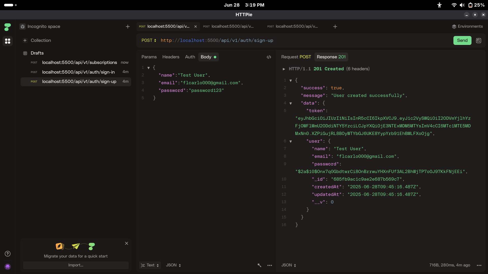
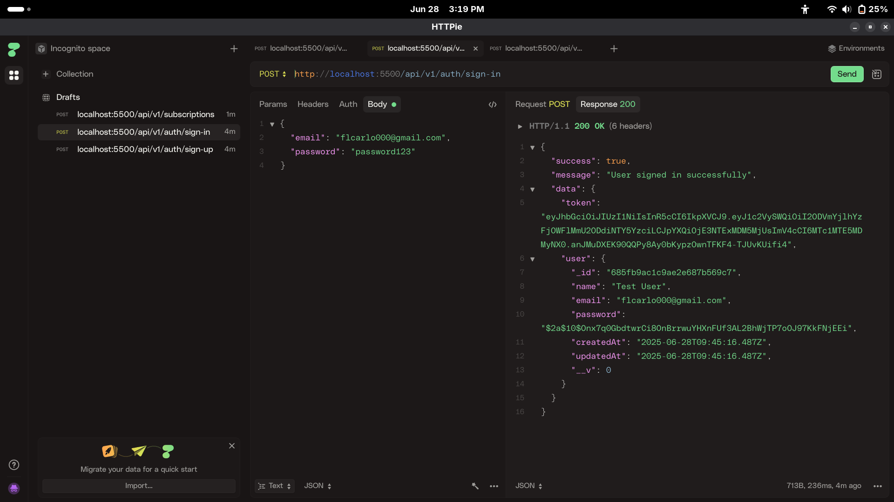
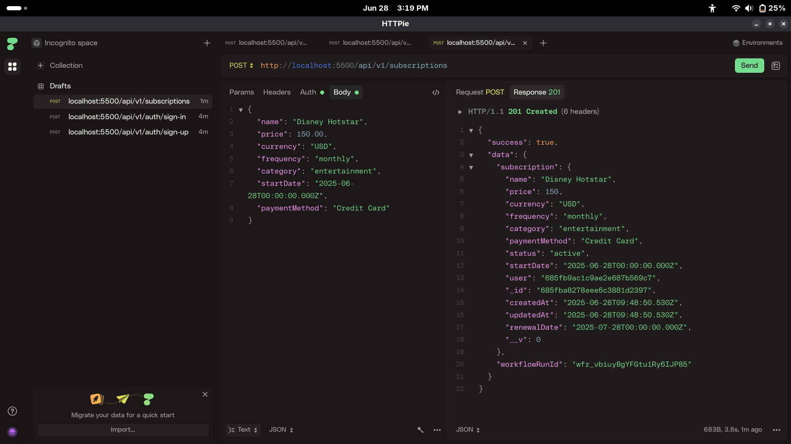
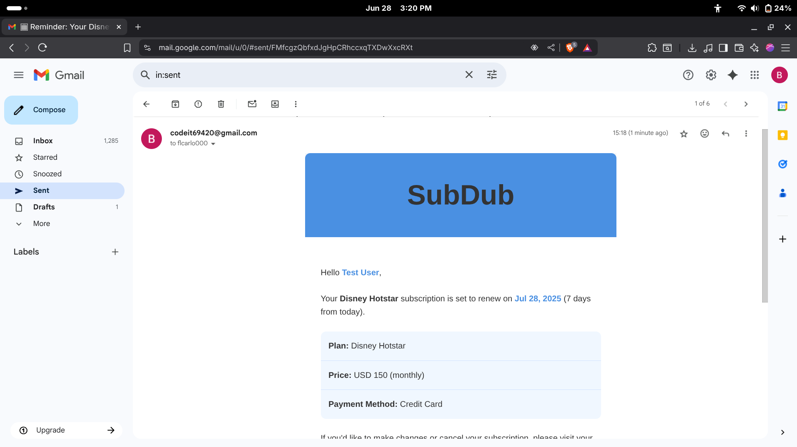

# 📦 Subscription Tracker API

A production-ready subscription management API built using Node.js, Express, and MongoDB — following Adrian Hajdin

## 📌 Features

- ✅ RESTful API with Express.js
- 🔐 Secure authentication with JSON Web Tokens (JWT)
- 📁 MongoDB for persistent data storage
- 🔄 Webhook handling using **Upstash QStash**
- 🛡️ Bot and abuse protection via **Arcjet**
- 📧 Email functionality using **Nodemailer**
---

## 🛠 Tech Stack

- **Backend**: Node.js, Express.js
- **Database**: MongoDB (Mongoose)
- **Emails Nodemailer**     
- **Other Tools**: dotenv, bcryptjs, CORS, Helmet, Morgan

---

## 📥 Getting Started

### 1. Clone the repository
```bash
https://github.com/floo69/sub-tracker.git
cd sub-tracker

### 2. npm install

### 3. Create a .env file
# PORT
PORT=5500
SERVER_URL="http://localhost:5500"

# ENVIRONMENT
NODE_ENV=development

# DATABASE
DB_URI=your_mongodb_uri

# JWT AUTH
JWT_SECRET=your_jwt_secret
JWT_EXPIRES_IN="1d"

# ARCJET (Security/Rate-Limiting)
ARCJET_KEY=your_arcjet_key
ARCJET_ENV="development"

# UPSTASH QSTASH (Webhook Handler)
QSTASH_URL=http://127.0.0.1:8080
QSTASH_TOKEN=your_upstash_token

# NODEMAILER (Email Service)
EMAIL_PASSWORD=your_gmail_app_password

### 4. Run the app
npm run dev
```
## 📸 Preview





